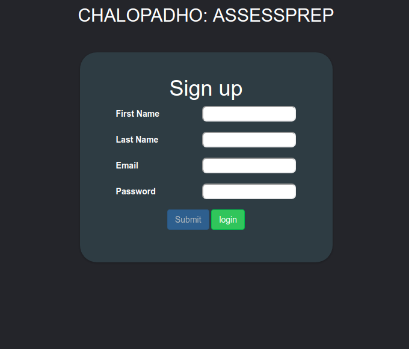
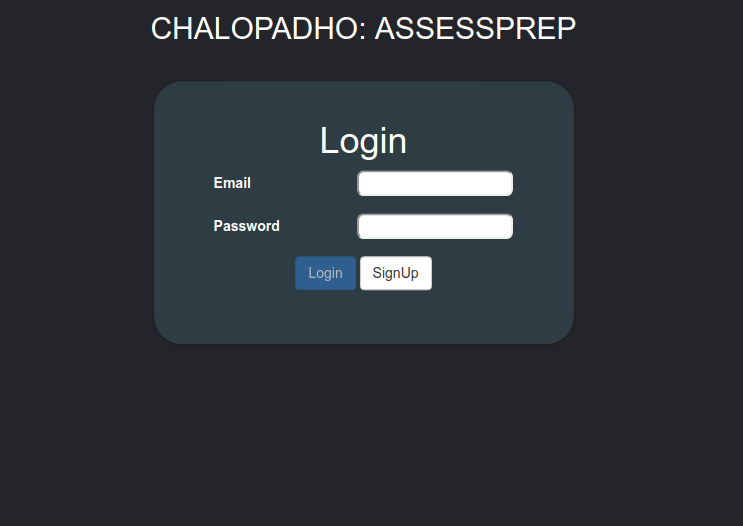
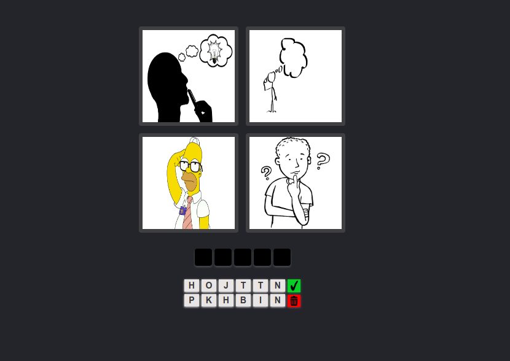
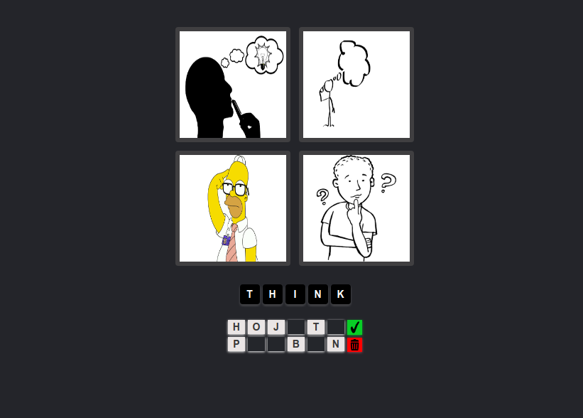
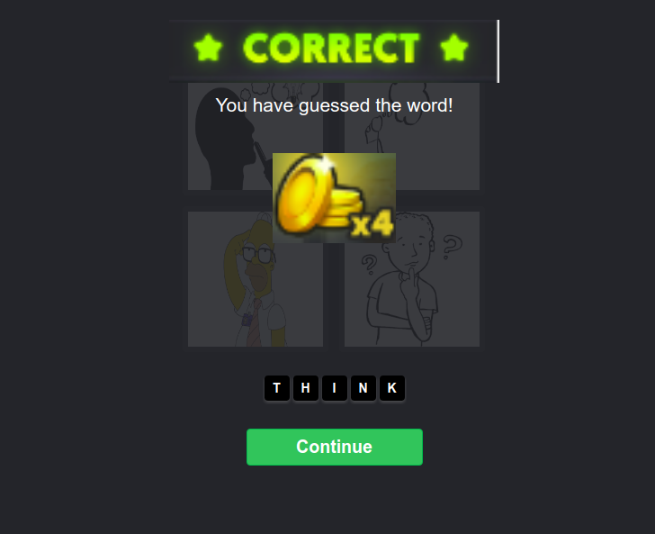
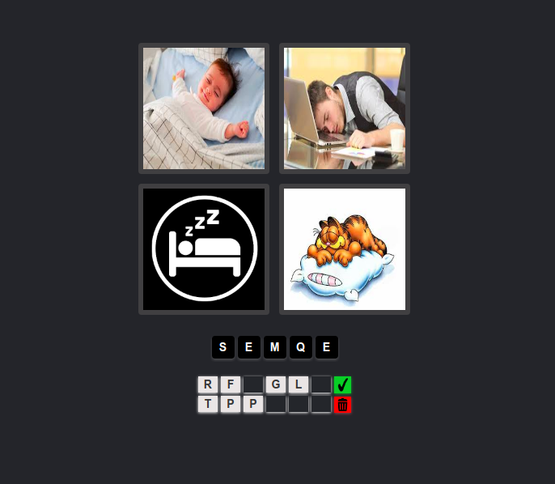
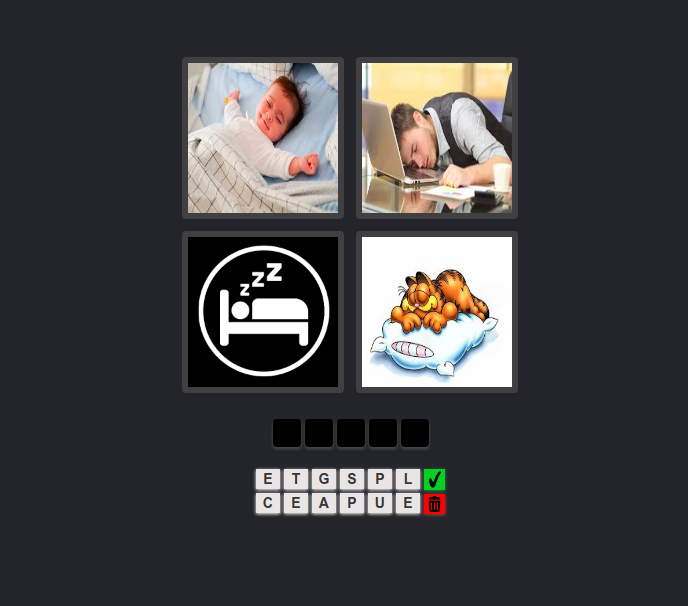

# chalopadho

1. Node and gulp is required. If it is not in your system:  
    <b>sudo apt-get install nodejs</b>  
    <b>sudo npm install -g gulp</b>  
    
2. git clone repo : <a href="https://github.com/Anamisinghal/chalopadho.git">https://github.com/Anamisinghal/chalopadho</a> 
3. <b> cd chalopadho</b>
4. <b>npm install && bower install</b>
5. <b>gulp</b>

 
 
<h2> App Views </h2>
User is maintained in localstorage. First need to register

email and password validations are applied here.. password should have <b>1 special character, 1 number and atleast 6 character</b>
 
 

Login to app  

Home Page: 

Press <b>next</b> button in footer
 
 
<b>Game Level 1</b> 
level is decided on the random basis  

After filling the answer  

On success  

in Next Level  

If answer is wrong and pressed correct sign, hint will be updated and answer palette will be cleared.  

